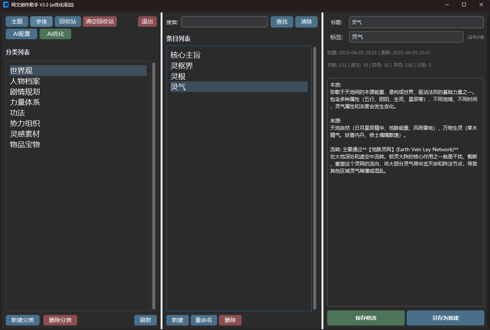

# 网文创作助手 (Novel Manager)

## 概述

网文创作助手是专为小说和文本创作者设计的高效内容管理系统。它提供了直观的分类组织、强大的编辑功能、灵活的搜索系统以及字体管理功能，帮助创作者更有条理地管理自己的创作内容，提升写作体验。

## 示例图片



## 核心功能

- **分层分类管理**：创建、重命名、移动和删除分类，构建个性化的组织结构
- **灵活内容编辑**：支持标题、正文、标签的编辑和格式化，快速保存和更新
- **多维度搜索**：根据内容、标题或标签进行全局搜索，轻松找到所需内容
- **回收站机制**：防止意外删除，支持恢复和永久删除操作
- **元数据管理**：自动跟踪创建和更新时间、标签和其他元信息
- **主题切换**：支持深色/浅色主题，保护视力并适应不同工作环境
- **字体系统**：支持系统字体和自定义字体，可调整字体大小和风格
- **文件同步**：随时刷新识别外部文件变化，支持多设备协作
- **批量操作**：支持多选条目进行移动、删除等批量处理

## 安装说明

### 方法一：直接运行源码

1. 安装 Python 3.6+（如果尚未安装）

   ```
   https://www.python.org/downloads/
   ```
2. 下载项目文件到本地文件夹
3. 安装依赖库（推荐）

   ```
   pip install customtkinter
   ```
   或者替代选项
   ```
   pip install sv-ttk
   ```
4. 运行主程序

   ```
   python novel_manager.py
   ```

### 方法二：使用打包版本（如果可用）

1. 从发布页面下载适合您系统的安装包
2. 运行安装程序并按照提示完成安装
3. 从开始菜单或桌面快捷方式启动应用程序

## 使用指南

### 初次使用

首次启动时，程序会自动创建必要的数据文件夹结构（默认在程序所在目录下的 `novel_data`文件夹中）。

### 界面布局

应用程序界面分为三个主要区域：

- **左侧面板**：分类列表，显示所有创建的分类目录
  - 顶部按钮：主题切换、回收站、清空回收站和退出
  - 底部按钮：新建分类、删除分类和刷新
- **中间面板**：条目列表，显示当前选中分类中的所有条目
  - 顶部搜索栏：支持全局文本搜索
  - 底部按钮：新建条目、删除选中和移动选中
- **右侧面板**：编辑区，包含标题输入框、标签输入框和正文编辑器

### 基础操作

#### 分类管理

- **创建分类**：点击"新建分类"按钮，输入分类名称
- **选择分类**：在左侧列表中点击任何分类
- **重命名分类**：右键点击分类，选择"重命名"
- **删除分类**：右键点击分类，选择"删除"（将移至回收站）

#### 条目管理

- **创建条目**：选择一个分类，点击"新建条目"按钮
- **编辑条目**：从中间列表选择条目，在右侧编辑区修改内容
- **保存内容**：完成编辑后点击"保存"按钮
- **重命名条目**：右键点击条目，选择"重命名"
- **移动条目**：选择一个或多个条目，点击"移动选中"按钮或右键点击选择"移动到分类"
- **删除条目**：选择一个或多个条目，点击"删除选中"或右键点击选择"删除"

#### 标签功能

- **添加标签**：在标签输入框中输入关键词，用逗号分隔多个标签
- **查看标签**：条目加载时显示其关联的所有标签
- **搜索标签**：在搜索框中使用 `#标签名` 格式特定搜索带有该标签的条目

#### 字体设置

- **字体选择**：通过菜单栏 "设置" > "字体设置" 打开字体对话框
- **系统字体**：可选择系统中已安装的所有字体
- **自定义字体**：可添加和使用自定义字体文件
- **字体大小**：调整文本编辑区和界面元素的字体大小
- **字体样式**：预览并应用选择的字体效果

#### 右键菜单功能

- **分类右键菜单**：新建、重命名和删除分类操作
- **条目右键菜单**：编辑、重命名、删除和移动条目操作

### 高级功能

#### 搜索操作

1. 在顶部搜索框中输入关键词
2. 点击"搜"按钮或按回车键执行搜索
3. 搜索结果显示在条目列表中，可以直接选择和编辑
4. 点击"清"按钮清除搜索结果，返回正常分类浏览

#### 回收站管理

- **查看回收站**：点击左上角的"回收站"按钮
- **恢复条目**：在回收站对话框中选择项目，点击"恢复选中项"
- **永久删除**：在回收站对话框中选择项目，点击"永久删除选中项"
- **清空回收站**：点击左上角的"清空回收站"按钮

#### 主题设置

- 点击界面左上角的主题切换按钮或通过菜单栏 "视图" > "主题" 切换深色或浅色主题
- 系统会记住上次选择的主题设置
- 支持现代化的UI风格（使用CustomTkinter或sv_ttk）

#### 文件系统同步

- 点击界面左下角的"刷新"按钮同步文件系统变化
- 识别外部添加的文件夹和文件
- 自动重新加载当前查看的内容

### 字体管理

#### 系统字体

- 自动加载系统中所有可用字体
- 按字母顺序排列，方便查找

#### 自定义字体

- 支持添加自定义字体文件（.ttf，.otf等）
- 从指定文件夹批量导入字体
- 记住自定义字体文件夹路径

#### 字体预览与应用

- 实时预览选择的字体效果
- 可调整字体大小（从小到大）
- 应用字体到编辑区域和/或界面元素
- 设置会自动保存，下次启动时自动加载

## 数据存储

- **存储位置**：所有数据存储在程序目录下的 `novel_data`文件夹中
- **分类结构**：每个分类对应一个子文件夹
- **文件格式**：条目以Markdown格式(.md)存储，包含JSON元数据头
- **元数据**：每个文件头部包含JSON格式的元数据（标题、创建时间、更新时间、标签等）
- **回收站**：删除的内容移至 `_trash`子文件夹，保留原始路径信息以便恢复
- **设置存储**：字体和界面设置保存在配置文件中，确保重启后一致性

## 技术细节

- **前端框架**：使用Python Tkinter构建跨平台GUI界面
- **增强UI**：可选集成CustomTkinter或sv_ttk库提供现代界面风格
- **字体引擎**：使用内置字体管理系统，支持系统和自定义字体
- **持久化**：使用基于文件系统的数据存储，无需数据库
- **元数据**：采用JSON格式存储在Markdown文件头部
- **路径处理**：使用pathlib模块处理文件路径，增强跨平台兼容性
- **异常处理**：完善的错误捕获和处理机制，提高程序稳定性

## 常见问题解答

### Q: 如何添加自定义字体？

**A**: 通过菜单栏 "设置" > "字体设置"，在弹出的对话框中选择"使用自定义字体"，然后点击"浏览"按钮选择字体文件或文件夹。

### Q: 我的文件夹和文件不显示在程序中

**A**: 点击界面左下角的"刷新"按钮，强制程序重新扫描文件系统并更新界面。

### Q: 回收站中的文件如何恢复？

**A**: 点击界面左上角的"回收站"按钮，在弹出的对话框中选择需要恢复的项目，然后点击"恢复选中项"。

### Q: 如何批量移动多个条目？

**A**: 在条目列表中通过按住Ctrl键（Mac上使用Command键）点击多个条目，然后点击"移动选中"按钮或右键选择"移动到分类"。

### Q: 如何备份我的所有内容？

**A**: 直接复制程序目录下的 `novel_data`文件夹即可完成备份。恢复时，将备份的文件夹内容替换回原位置。

### Q: 如何更改编辑器的字体大小？

**A**: 通过菜单栏 "设置" > "字体设置"，调整字体大小滑块，然后点击"应用"。

### Q: 能否在不同设备间同步内容？

**A**: 可以通过云存储服务（如OneDrive、Dropbox等）同步 `novel_data`文件夹，在不同设备上使用相同的数据。

## 小技巧

1. **善用字体设置**：选择适合长时间写作的舒适字体和大小，减轻眼部疲劳
2. **使用标签系统**：充分利用标签功能对内容进行分类，使搜索更精准
3. **快捷键操作**：使用Ctrl+S保存，Ctrl+F搜索，提高效率
4. **分类结构设计**：合理规划分类结构，避免过深的嵌套
5. **定期刷新同步**：如果使用外部编辑器修改文件，记得在程序中刷新以同步变化
6. **主题切换**：根据环境光线和个人喜好切换深浅主题，保护视力
7. **批量操作提高效率**：使用多选进行批量移动和删除操作
8. **定期备份**：定期备份 `novel_data`文件夹，防止意外数据丢失

## 未来计划

- 统计分析工具（字数统计、写作时间等）
- 导出为多种格式（PDF、EPUB等）
- 更多自定义选项

## 许可与贡献

- **版权**：保留所有权利
- **使用许可**：个人免费使用
- **反馈与建议**：欢迎通过问题跟踪系统提交问题报告和功能建议

---

